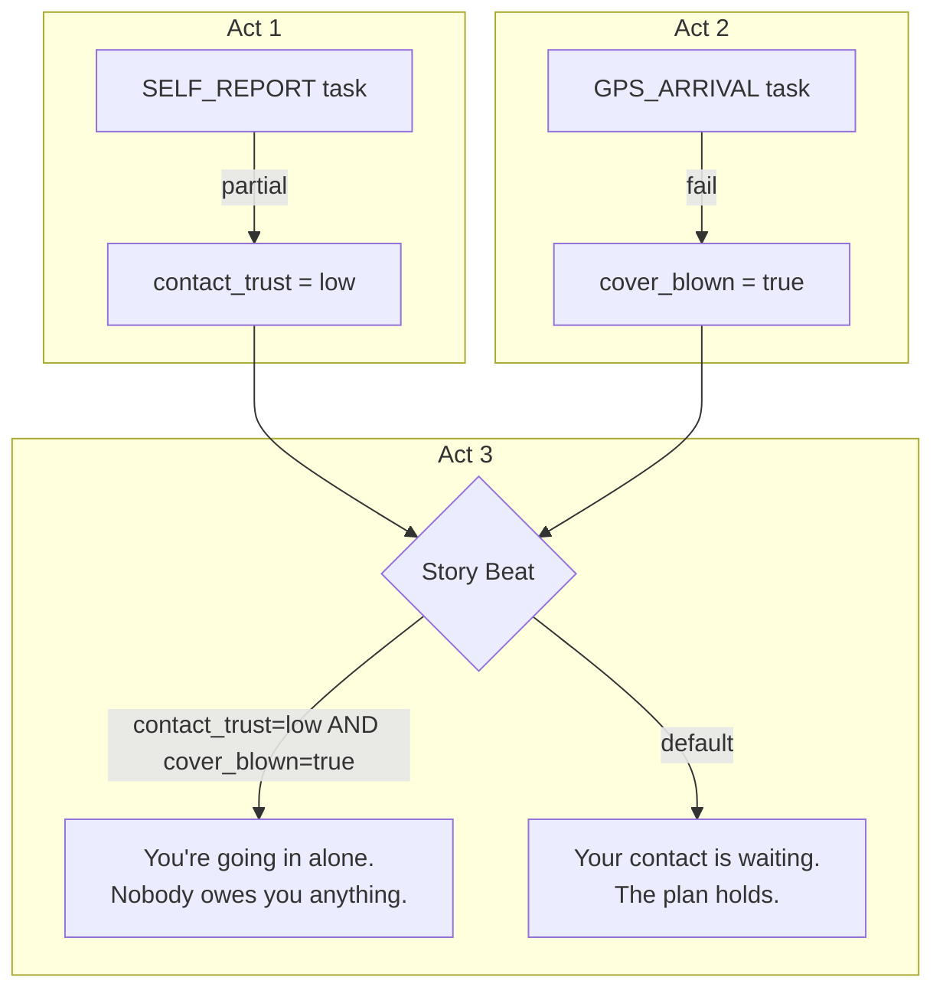
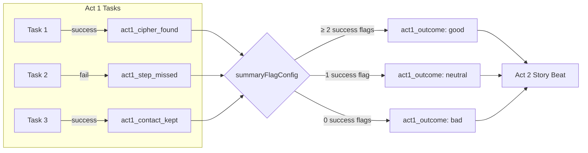
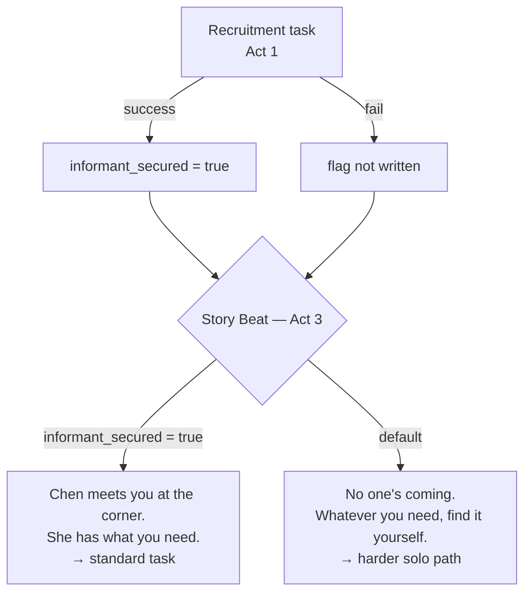
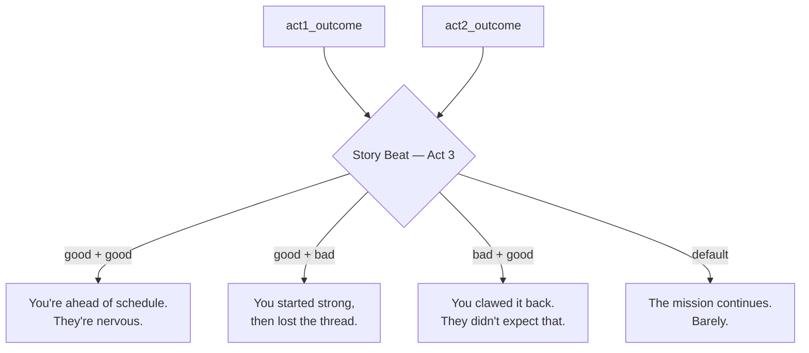
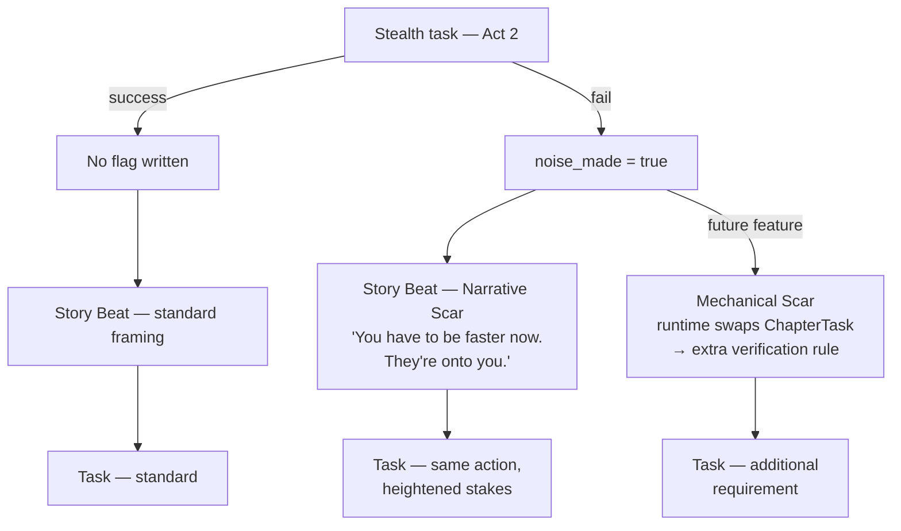

# Story Builder

The creator tool for assembling tasks into a mission's full narrative structure. This is where the spy thriller, detective story, or walking tour comes alive — wrapping story-agnostic tasks in narrative context at every level.

---

## Overview

The Story Builder lets creators compose the Mission → Act → Chapter → ChapterTask hierarchy and author narrative text at each level. The creator brings the voice; the tasks provide the real-world actions. The Story Builder is where those two things are joined.

Any signed-in user can access the Story Builder. Reputation tier affects how submitted missions are treated in moderation — not whether the tool is available. Revenue sharing eligibility for Architect-tier creators is the one exception: it is gated on tier, not on the tool itself.

---

## Flows

### Create a Mission
1. Creator enters the mission title, mission brief (shown to players on the browse screen), and an estimated duration.
2. Creator sets the reputation tier required to play the mission.
3. Mission is saved as a draft. Acts can now be added.

### Add an Act
1. Creator pins a Stop on a map (lat/lng) and sets the arrival radius.
2. Creator names the act (internal label) and optionally writes act-level narrative framing.
3. Creator configures `summaryFlagConfig`: the threshold rules that compute the act's summary flag at completion (e.g. "if 2 or more success flags → good; if 1 → neutral; if 0 → bad").
4. Chapters can now be added to the Act.

### Add a Chapter
1. Creator writes the chapter `intro_narrative` (shown to the player before any tasks in the chapter).
2. Creator writes the chapter `outro_narrative` (shown after all tasks in the chapter are complete).
3. Tasks can now be placed into the Chapter.

### Place a Task (ChapterTask)
1. Creator selects a task from their library or the community task library.
2. Creator writes the default `pre` narrative variant — the story context shown to the player before the task begins.
3. Creator configures `outcomeFlags`: for each outcome code (`1` = success, `2` = partial, `3` = fail), which flag name to write to `MissionRun.flags`.
4. Creator writes the default outcome narrative variants: for each outcome code, the narrative text shown to the player immediately after the task resolves.
5. The ChapterTask is saved. The creator can reorder tasks within the chapter.

### Narrative Variants
Any `ChapterTask` placement — regardless of task type — can have multiple narrative variants per slot. Slots are:

- `pre` — shown to the player before the task begins
- `outcome_1` — shown after a success outcome
- `outcome_2` — shown after a partial outcome
- `outcome_3` — shown after a fail outcome

Each variant carries `conditions[]` (flag name + expected value pairs, AND logic). At runtime, the first variant whose conditions all match is shown. A variant with no conditions is the default fallback. `STORY_BEAT` tasks use only the `pre` slot — the whole task is its pre-narrative.

### Preview & Publish
1. Creator can preview the mission in a read-only walkthrough that shows the narrative text at each level.
2. When ready, the creator submits the mission for moderation review.
3. A moderator approves or rejects the submission. Approved missions are published and visible to players.

---

## Narrative Hierarchy

```
Mission
  Brief: "You've been tasked with recovering a stolen data chip..."

  Act 1  (Stop: 1.285°N, 103.856°E, radius 50m)
    Act narrative framing: "The drop point is Raffles Place MRT..."
    summaryFlagConfig: { good: ≥2 success flags, neutral: 1, bad: 0 }

    Chapter 1  (intro: "Blend in. Do not make eye contact.")
      ChapterTask 1
        task: ANSWER_MATCH (answer: "CIPHER")
        outcomeFlags: { "1": "act1_cipher_found", "3": "act1_cipher_missed" }

        NarrativeVariant  slot: pre
          default:                    "There's a newspaper on the bench. Check the crossword."
          cover_blown=true:           "They may have moved it. Check the crossword anyway."

        NarrativeVariant  slot: outcome_1  (success)
          default:                    "You find the code. Your handler will be pleased."
          act1_contact_trust=low:     "You find the code. Small consolation."

        NarrativeVariant  slot: outcome_2  (partial)
          default:                    "Close — but you're not sure. Press on."

        NarrativeVariant  slot: outcome_3  (fail)
          default:                    "Nothing. Either it's gone or you missed it."
          cover_blown=true:           "Nothing — and now they know you were looking."

      outro: "Time to move before anyone notices."
```

---

## Branching Strategies

Branching in Mission: Tour follows a Telltale-style model: the story always continues, but the player arrives differently. Consequences change what the player *has* and *how the world treats them* — not whether they can proceed.

All strategies below build on the same three primitives: `outcomeFlags` (write a flag on task completion), `NarrativeVariant.conditions[]` (read flags in any pre or outcome slot), and `Act.summaryFlagConfig` (collapse flags into a summary at act end). The implementation cost between strategies is low; the craft is in how you use them.

---

### Strategy 1: Flag Debt

Small failures accumulate silently and cash out at a dramatic moment later. No individual failure seems fatal, but a cluster of them triggers a harder narrative path.

**Pattern:** Write a flag on each partial/fail outcome. A story beat deep in Act 3 checks two or three of these together.

```
act1_contact_trust: low        (from partial on SELF_REPORT task)
act2_cover_blown: true         (from fail on GPS_ARRIVAL task)

Story beat condition:
  act1_contact_trust=low AND act2_cover_blown=true
  → "You're going in alone. Nobody owes you anything now."
```



**Creator principle:** Design flags as *debts*, not just states. Each one is a bill that gets paid later.

---

### Strategy 2: Act Summary Convergence

Per-task flags collapse into one act-level verdict via `summaryFlagConfig`. Downstream acts read the summary flag, not the individual ones.

```
summaryFlagConfig:
  good:    ≥2 success flags
  neutral: 1 success flag
  bad:     0 success flags
→ writes act1_outcome: good | neutral | bad
```



This bounds the branching to three states per act. Three acts × three outcomes = 27 possible paths, but you only write 3 story beat variants per branch point.

**Creator principle:** Define the act summary flag *before* designing individual tasks. Ask: "What is the one verdict the player carries out of this act?"

---

### Strategy 3: Witnesses

NPCs or narrative assets in later chapters only appear if a prior flag was set. The player who failed an earlier task works alone; the player who succeeded gets a contact who eases the next task.

**Pattern:** The pre-narrative slot has two variants — one gated on the flag, one as the default.

```
NarrativeVariant  slot: pre
  conditions: [informant_secured=true]  → "Chen meets you at the corner. She has what you need."
  default                               → "No one's coming. Whatever you need, you're finding it yourself."
```



**Creator principle:** Always write the *absence* as a scene, not a gap. The player who failed should feel the ghost of the help they didn't earn.

---

### Strategy 4: Compound Conditions

`NarrativeVariant.conditions[]` uses AND logic. Combine two summary flags to express surprisingly specific emotional states cheaply.

```
act1_outcome=good AND act2_outcome=bad
  → "You started strong, then lost the thread."

act1_outcome=bad AND act2_outcome=good
  → "You clawed it back. They didn't expect that."

default
  → "The mission continues. Barely."
```



You're not writing four story paths — you're writing two flags and four short paragraphs. The system assembles the emotional arc.

**Creator principle:** The most satisfying story beat is the one that names exactly what happened to *this* player. Compound conditions let you do that without exponential branching.

---

### Strategy 5: Scar Pattern

A failure doesn't block — it carries forward as a narrative constraint that makes a later moment harder but still completable.

**Two implementation tiers:**

**Narrative scar** (no new tech required) — A `STORY_BEAT` before the affected task reads the flag and reframes the scene. Same task, more urgent tone. The player who failed feels the weight through context.

```
NarrativeVariant  slot: pre
  conditions: [noise_made=true]  → "You have to be faster now. They're onto you."
  default                        → "Move to the next position."
```

**Mechanical scar** (requires runtime flag-routing) — A different `ChapterTask` is served based on a flag: an extra verification rule, a stricter answer, or a harder physical task. This requires the runtime to conditionally skip or swap `ChapterTask` rows — a feature not yet in the current model.



**Creator principle:** Start with narrative scars. The mechanical version is the only strategy requiring new routing logic; narrative framing alone captures ~80% of the "harder path" feeling.

---

### Creator Workflow for Branching

Design in this order to avoid flag spaghetti:

1. **Define act summary flags first** — what is the one verdict per act?
2. **Map the flag debt chain** — which early flags echo in later acts?
3. **Write the default path** — assume a neutral player; this is your spine
4. **Write high/low variants** — good and bad outcomes of each summary flag
5. **Add witnesses sparingly** — one conditional NPC per act maximum to start
6. **Write absence scenes** — for every conditional scene, write the version without it

---

### Flag Visibility (Creator Tooling Requirement)

Flag systems collapse into unmaintainable spaghetti without editor support. The Story Builder must show creators, at each `ChapterTask` narrative variant panel:

- All flags written by earlier `ChapterTask` placements in the same mission
- All flags currently referenced in `NarrativeVariant.conditions[]` across the mission
- The computed summary flag name and its threshold rules for the current act

Without this visibility, creators cannot reason about branching state across a multi-act mission.

---

## UI States

- **Mission draft** — editable; no player access
- **Act / Chapter / ChapterTask** — each has its own edit panel in the builder; reorderable via drag
- **Flag config panel** — visual editor for outcomeFlags and summaryFlagConfig; shows a live flag name preview
- **Preview mode** — read-only narrative walkthrough; no task interaction
- **Submitted for review** — locked; awaiting moderator decision
- **Revision requested** — unlocked with moderator feedback; creator can edit and resubmit
- **Published** — live; read-only in the builder

---

## Data Needs

- `Mission` — `title`, `brief`, `estimatedDurationMinutes`, `reputationTierRequired`, `status`, `createdBy`
- `Act` — `missionId`, `stopLat`, `stopLng`, `stopRadiusM`, `summaryFlagConfig: Json`, `order`
- `Chapter` — `actId`, `introNarrative`, `outroNarrative`, `order`
- `ChapterTask` — `chapterId`, `taskId`, `outcomeFlags: Json`, `order`
- `NarrativeVariant` — `chapterTaskId`, `slot: 'pre' | 'outcome_1' | 'outcome_2' | 'outcome_3'`, `conditions: Json[]`, `narrative`, `order`
- Status flow: `draft → pending_review → approved | rejected → published`
